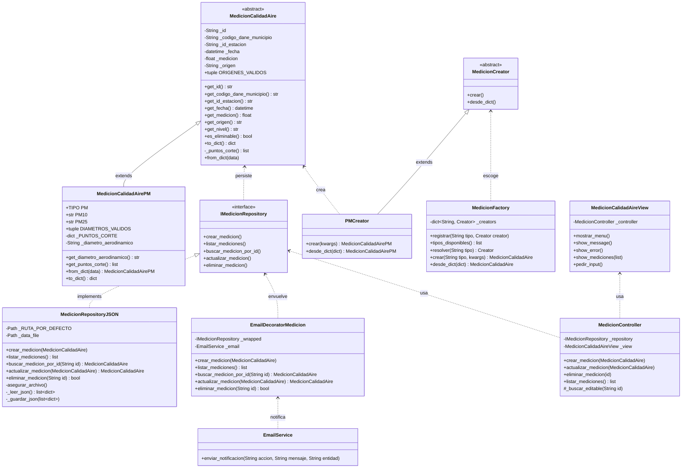

# Observatorio Calidad Aire

Sistema de gestion y consulta de calidad del aire a nivel municipal.

## Descripcion del sistema

El observatorio administra un catalogo de **municipios** y **estaciones
de monitoreo**, donde cada estacion esta asociada a un municipio. Sobre
ese catalogo se registran **mediciones** de contaminantes criterio
(PM2.5, PM10, etc.) y se administran **alertas ambientales**.

## Arquitectura y enfoque

El proyecto se desarrolla con:

- Patron **MVC** (Model - View - Controller).
- Patron **Repository/DAO** para persistencia.
- Patron **Factory Method** (GoF) para instanciar mediciones por
  contaminante: jerarquia `MedicionCreator` paralela a la de productos
  (`src/factories/medicion_creator.py`), con un registro central en
  `src/factories/medicion_factory.py`.
- Archivos **JSON** como almacenamiento local.
- Validaciones de dominio y excepciones personalizadas.

## Instalacion

1. Crear y activar entorno virtual (opcional):

```bash
python -m venv .venv
```

2. Instalar dependencias:

```bash
pip install -r requirements.txt
```

## Ejecucion

Desde la carpeta `observatorio_calidad_aire`, ejecutar:

```bash
python main.py
```

Al iniciar se muestra una pantalla de bienvenida con dos accesos:

1. Empleado: abre una ventana de login y valida las credenciales ya existentes.
2. Visitante: entra directamente en modo consulta.

El sistema principal permite acceder a:

1. Modulo Estaciones
2. Modulo Municipios
3. Modulo Mediciones
4. Modulo Alertas
5. Salir

## Estructura del proyecto

- `src/models`: entidades del dominio.
- `src/repositories`: acceso a datos en archivos JSON.
- `src/controllers`: logica de coordinacion entre vistas y repositorios.
- `src/views`: menus de consola por modulo.
- `src/factories`: factories para instanciar entidades polimorficas.
- `src/exceptions`: excepciones personalizadas.
- `data/`: archivos JSON de persistencia.
- `tests/`: pruebas unitarias con `pytest`.
- `entregables/actividad7/`: evidencias individuales por integrante.

## Modulos implementados (Actividad 7)

Cada modulo incluye modelo, repository, controller, view, validaciones,
reglas de negocio y pruebas unitarias.

### EstacionAmbiental

- CRUD completo sobre `data/estaciones.json`.
- Validaciones de campos obligatorios y estado `Activa/Inactiva`.
- Regla de negocio: no permitir estaciones duplicadas por `id_estacion`.

### Municipio

- CRUD completo sobre `data/municipios.json`.
- Validaciones de campos obligatorios y estado `Activo/Inactivo`.
- Regla de negocio: no permitir municipios duplicados por `id_municipio`.

### MedicionCalidadAire

- CRUD completo sobre `data/mediciones.json`.
- Modelo polimorfico: clase base abstracta `MedicionCalidadAire` y una
  subclase por contaminante (actualmente `MedicionCalidadAirePM` para
  PM10 y PM2.5). Agregar un contaminante nuevo solo requiere crear un
  `MedicionCreator` concreto y registrarlo en `MedicionFactory` (OCP).
- Distincion entre mediciones `MANUAL` (creadas/editables por el
  usuario) y `AUTOMATICO` (provenientes de sensores; inmutables).
- Integridad referencial: al crear una medicion se valida que el
  `codigo_dane_municipio` y el `id_estacion` existan en sus catalogos.
- Regla de negocio: clasificacion ICA segun Res. 2254/2017 (Tabla 6),
  con puntos de corte propios por contaminante:
  `Buena`, `Aceptable`, `Daniña a la salud de grupos sensibles`,
  `Daniña a la salud`, `Muy daniña a la salud`, `Peligrosa`.


### AlertaAmbiental

- CRUD completo sobre `data/alertas.json`.
- Validaciones de campos obligatorios, nivel y estado permitidos.
- Regla de negocio: si el `nivel` es `Alto`, el `estado` final es `Activa`.

## Excepciones personalizadas

- `DatoInvalidoError`
- `RegistroDuplicadoError`
- `RegistroNoEncontradoError`
- `ArchivoInvalidoError`

## Pruebas unitarias

Ejecutar desde la raiz del proyecto:

```bash
pytest -v
```

Estado actual de la Actividad 7:

- 10 pruebas de AlertaAmbiental
- 10 pruebas de EstacionAmbiental
- 10 pruebas de Municipio
- 10 pruebas de MedicionCalidadAire (repositorio)
- 10 pruebas de MedicionCalidadAire (modelo: clasificacion ICA y validaciones)
- 10 pruebas de MedicionCalidadAire (controller)

Total: **60 pruebas unitarias**.

## Integrantes y entidad asignada

| Integrante | Entidad | Estado |
|---|---|---|
| Liz Giselle Tuiran Alvarez | AlertaAmbiental | Implementado |
| Juan Camilo Moreno Perez| EstacionAmbiental | Implementado |
| Daniel Felipe Moreno Suarez | Municipio | Implementado |
| Jose Miguel Rojas Urueta | MedicionCalidadAire | Implementado |



