# Universidad de La Salle

## Lenguajes II

### Actividad 8 - Patrones GoF aplicados al proyecto Observatorio de Calidad del Aire

**Integrantes**

- Liz Giselle Tuiran Alvarez
- Juan Camilo Moreno Perez
- Daniel Felipe Moreno Suarez
- Jose Miguel Rojas Urueta 

**Docente**  
Rodrigo Aranda Fernandez

**Fecha**  
Mayo 2026

---

# Patrones GoF aplicados al proyecto Observatorio de Calidad del Aire

## Tabla de contenido

- [Introducción](#introducción)
- [Objetivo del documento](#objetivo-del-documento)
- [Qué son los patrones GoF](#qué-son-los-patrones-gof)
- [Clasificación general](#clasificación-general)
- [Tabla resumen de los 23 patrones](#tabla-resumen-de-los-23-patrones)
- [AlertaAmbiental](#Módulo-AlertaAmbiental)
- [EstacionAmbiental](#bloque-juanito---estacionambiental)
- [Municipio](#bloque-daniel---municipio)
- [MedicionCalidadAire](#bloque-jose---medicioncalidadaire)
- [Conclusión](#conclusión)
- [Referencias bibliográficas básicas](#referencias-bibliográficas-básicas)

## Introducción

Este documento presenta el borrador teórico de la Actividad 8 sobre patrones GoF, contextualizado al proyecto `observatorio_calidad_aire`. El enfoque se centra en explicar, de forma académica y comprensible, cómo cada patrón puede aportar al diseño del sistema, considerando las entidades reales del dominio: `EstacionAmbiental`, `Municipio`, `MedicionCalidadAire` y `AlertaAmbiental`.

## Objetivo del documento

Organizar y describir los 23 patrones GoF mediante una estructura uniforme que facilite:

- El trabajo colaborativo por integrante.
- La trazabilidad de aportes en Git.
- La preparación de la fase práctica posterior.
- La relación entre patrones, reglas de negocio y arquitectura MVC + Repository.

## Qué son los patrones GoF

Los patrones GoF (Gang of Four) son soluciones reutilizables a problemas frecuentes de diseño orientado a objetos. No son código cerrado, sino guías para estructurar clases y responsabilidades con mejor mantenibilidad, extensibilidad y bajo acoplamiento.

## Clasificación general

- **Creacionales:** se enfocan en la creación flexible de objetos.
- **Estructurales:** se enfocan en la composición y organización de clases/objetos.
- **De comportamiento:** se enfocan en la comunicación y asignación de responsabilidades.

## Tabla resumen de los 23 patrones

| Patrón | Categoría | Problema que resuelve | Diagrama | Casos de uso | Ventajas/Desventajas | Relacionados |
|---|---|---|---|---|---|---|
| Abstract Factory | Creacional | Crear familias de objetos relacionadas sin acoplar al cliente a clases concretas. | 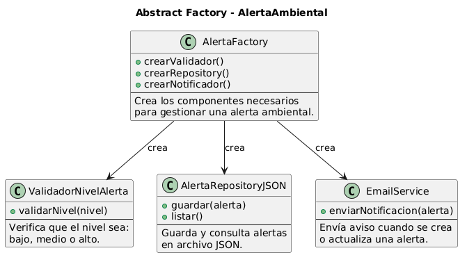 | Crear componentes según tipo de entidad. | + Consistencia, - Mayor complejidad inicial. | Factory Method, Builder |
| Builder | Creacional | Construir objetos complejos paso a paso. | 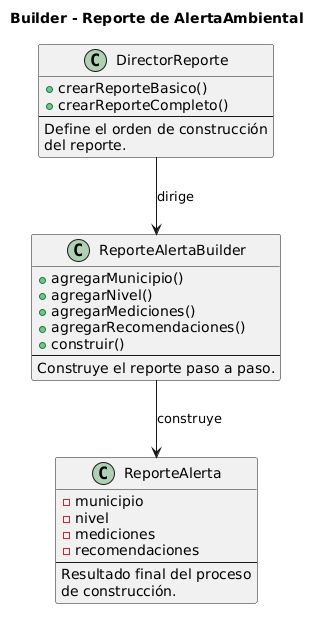 | Crear reportes de alertas con distintos niveles de detalle. | + Claridad, - Más clases. | Abstract Factory, Prototype |
| Factory Method | Creacional | Delegar la decisión de qué clase concreta instanciar. | 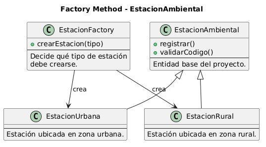 | Crear repositorios específicos por entidad. | + Bajo acoplamiento, - Jerarquía adicional. | Abstract Factory, Template Method |
| Prototype | Creacional | Clonar objetos evitando recreación completa. | 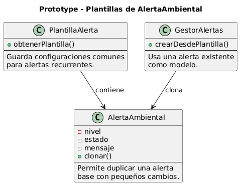 | Duplicar configuraciones de alerta o estaciones. | + Rapidez, - Riesgo con copias profundas. | Builder, Singleton |
| Singleton | Creacional | Garantizar una única instancia compartida. | 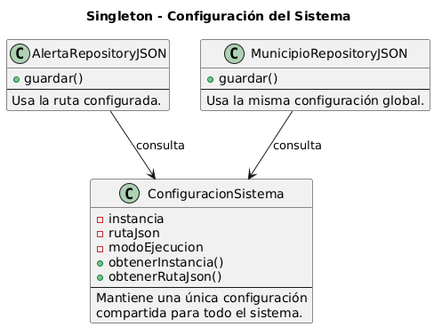 | Configuración global de rutas JSON o logger. | + Control centralizado, - Dificulta pruebas si se abusa. | Facade, Factory Method |
| Adapter | Estructural | Integrar interfaces incompatibles. | 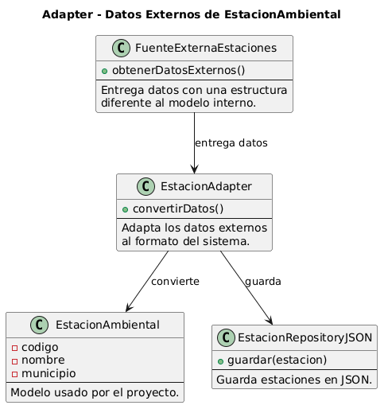 | Consumir fuentes externas de medición con formato diferente. | + Reutilización, - Capa extra. | Facade, Bridge |
| Bridge | Estructural | Separar abstracción de implementación para evolución independiente. | 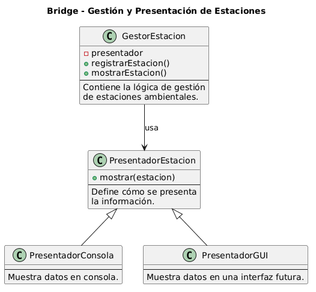 | Separar vistas (consola/GUI) de lógica de notificación. | + Escalabilidad, - Diseño inicial más abstracto. | Adapter, Strategy |
| Composite | Estructural | Tratar objetos simples y compuestos de forma uniforme. | 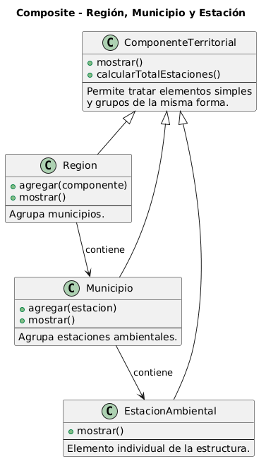 | Agrupar alertas por municipio o región. | + Operaciones uniformes, - Puede sobre-generalizar. | Iterator, Visitor |
| Decorator | Estructural | Agregar responsabilidades dinámicamente sin herencia excesiva. | 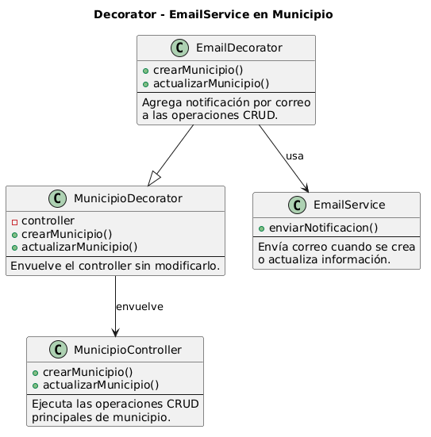 | Envolver controller de municipio con EmailService. | + Flexible, - Multiplica objetos. | Facade, Strategy |
| Facade | Estructural | Ofrecer una interfaz simple sobre subsistemas complejos. | 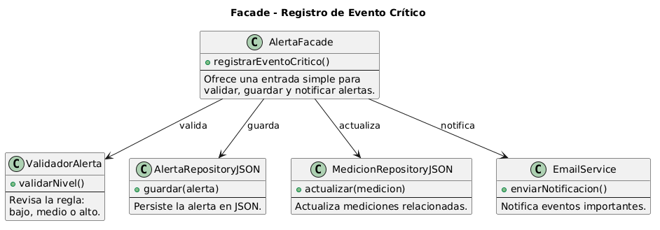 | Servicio único para orquestar CRUD + validación + notificación. | + Simplifica uso, - Puede ocultar detalles relevantes. | Singleton, Adapter |
| Flyweight | Estructural | Compartir estado común para reducir memoria. | 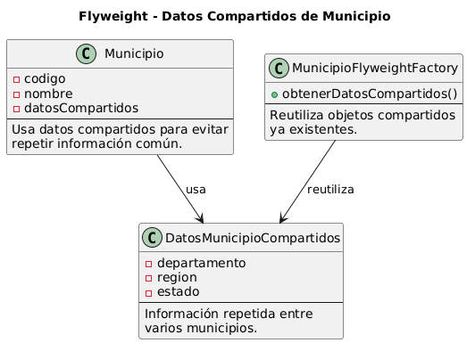 | Compartir catálogos de estados y niveles. | + Eficiencia, - Gestión de estado más delicada. | Factory Method, Composite |
| Proxy | Estructural | Controlar acceso a un objeto real. | 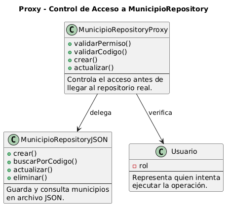 | Restringir operaciones según rol (consulta/escritura). | + Seguridad y control, - Latencia/capa extra. | Decorator, Facade |
| Chain of Responsibility | Comportamiento | Encadenar validaciones sin acoplar emisor a receptor final. | 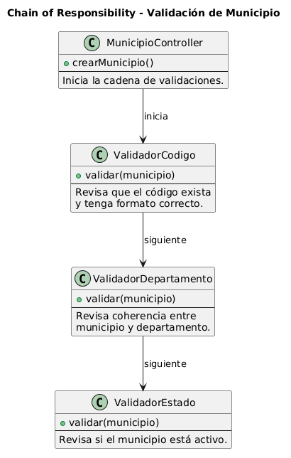 | Validar campos de mediciones y alertas en pasos. | + Extensible, - Flujo menos obvio. | Command, Strategy |
| Command | Comportamiento | Encapsular acciones como objetos ejecutables. | 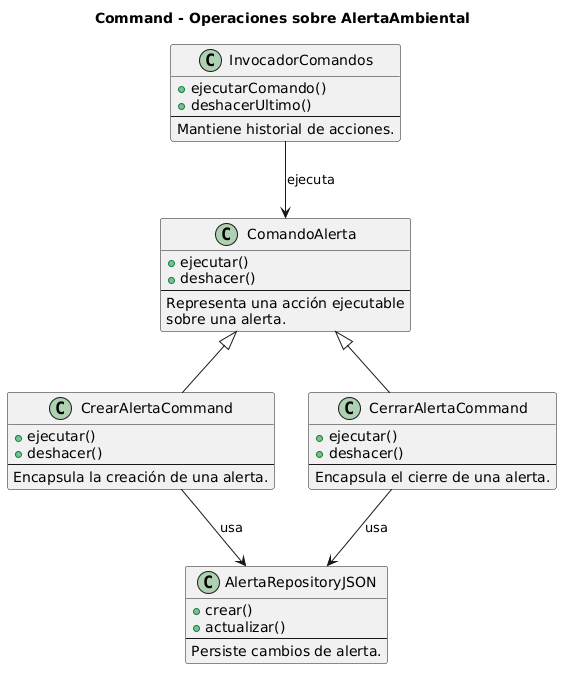 | Registrar operaciones CRUD para auditoría o deshacer. | + Historial/reversión, - Más clases. | Chain of Responsibility, Memento |
| Interpreter | Comportamiento | Definir gramática y evaluación de expresiones. | 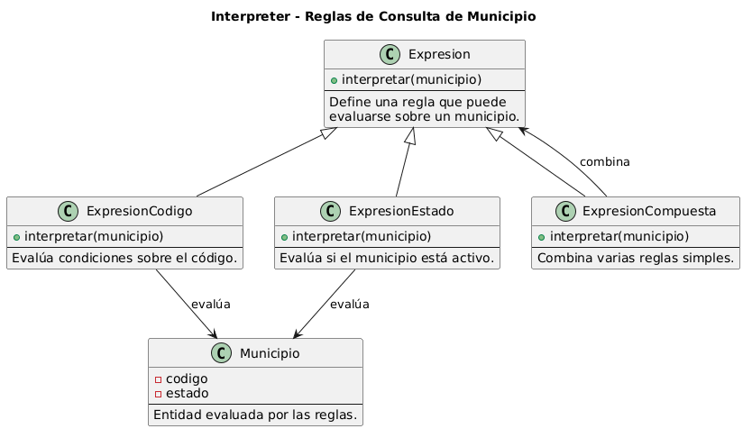 | Evaluar reglas textuales de umbrales de alerta. | + Reglas declarativas, - Escala mal en gramáticas complejas. | Strategy, Visitor |
| Iterator | Comportamiento | Recorrer colecciones sin exponer su estructura interna. | 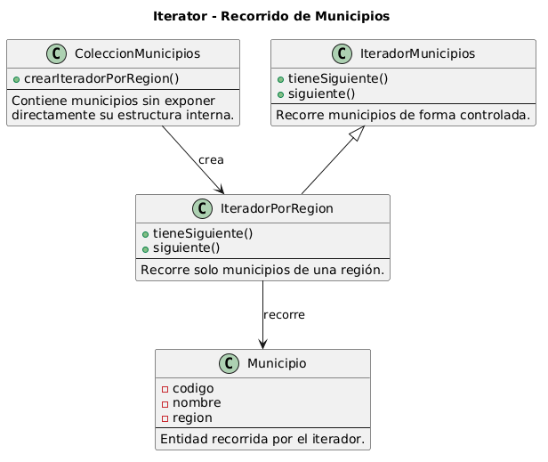 | Recorrer mediciones por fecha o municipio. | + Encapsula recorrido, - Objetos adicionales. | Composite, Visitor |
| Mediator | Comportamiento | Centralizar comunicación entre objetos. | 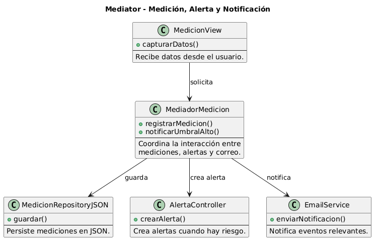 | Coordinar vistas y controladores sin acoplamiento directo. | + Menos dependencias, - Riesgo de mediador gigante. | Observer, Facade |
| Memento | Comportamiento | Guardar/restaurar estado sin romper encapsulamiento. | 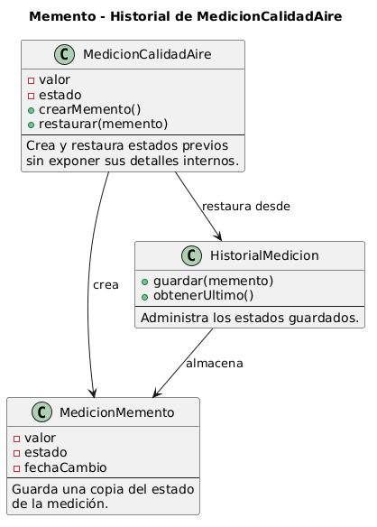 | Revertir cambios de actualización en alertas. | + Recuperación, - Costo de almacenamiento. | Command, State |
| Observer | Comportamiento | Notificar cambios a múltiples suscriptores. | 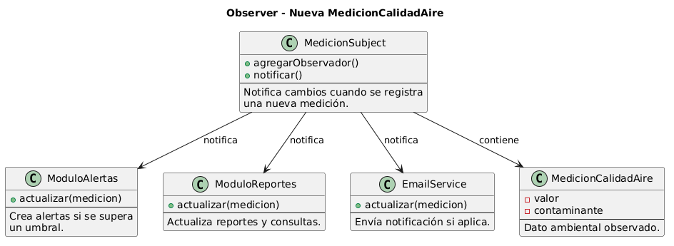 | Alertar módulo de reportes y notificaciones al crear alertas. | + Desacopla eventos, - Orden de notificación puede ser complejo. | Mediator, Decorator |
| State | Comportamiento | Cambiar comportamiento según estado interno. | 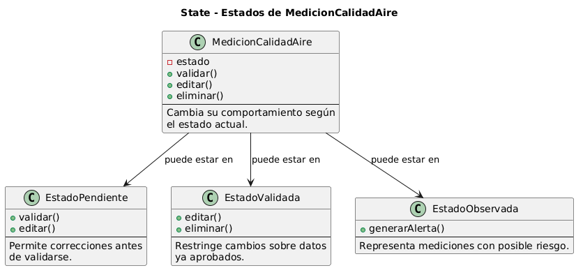 | Transiciones de alerta: Activa/Cerrada. | + Reglas claras por estado, - Más clases. | Strategy, Command |
| Strategy | Comportamiento | Intercambiar algoritmos de forma dinámica. | 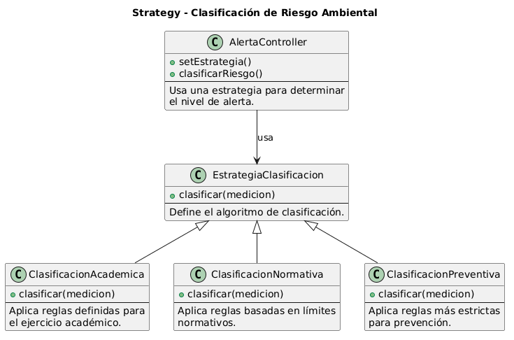 | Distintas reglas de clasificación de riesgo. | + Flexibilidad, - Cliente debe conocer estrategias. | State, Factory Method |
| Template Method | Comportamiento | Definir esqueleto de algoritmo con pasos personalizables. | 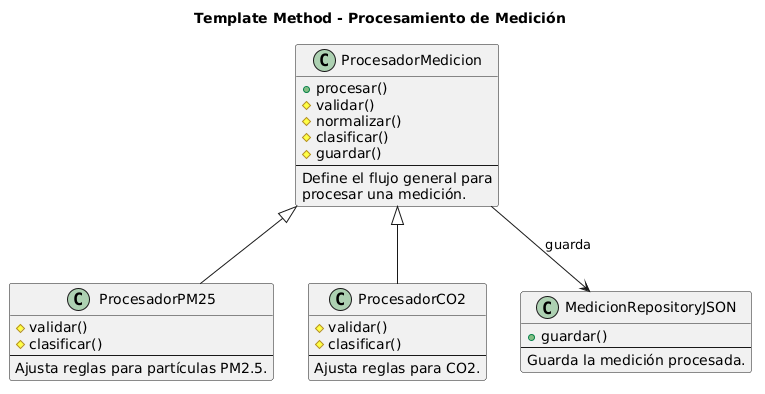 | Flujo común de validación y guardado en entidades. | + Reutilización, - Dependencia de herencia. | Factory Method, Strategy |
| Visitor | Comportamiento | Agregar operaciones sobre estructuras sin modificar clases base. | 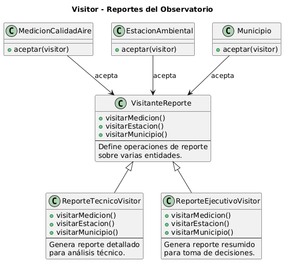 | Generar reportes por entidad sin alterar modelos. | + Extiende operaciones, - Agregar nuevas clases base cuesta. | Composite, Interpreter |

---

# Módulo AlertaAmbiental
### Integrante responsable
Liz Giselle Tuiran Alvarez

---

## Patrón: Abstract Factory

### Integrante responsable
Liz Giselle Tuiran Alvarez

### Entidad asociada
AlertaAmbiental

### Regla básica de negocio relacionada
El nivel de alerta debe ser bajo, medio o alto.

### Categoría
Creacional

### Problema que resuelve
Permite crear familias de objetos relacionadas (por ejemplo, validadores, formateadores y notificadores de alerta) sin depender de clases concretas.

### Diagrama de clases

### Casos de uso en el proyecto Observatorio de Calidad del Aire
- Caso 1: En la capa MVC del módulo `AlertaAmbiental`, se aplicaría para crear una familia de objetos de aplicación (validador de nivel, `Repository` y servicio de notificación) según el contexto de ejecución; resuelve el problema de acoplar el controller a clases concretas; es útil porque permite cambiar entre entorno académico y entorno productivo sin reescribir la lógica principal.
- Caso 2: En pruebas de integración, se aplicaría para instanciar versiones de componentes con persistencia simulada en JSON temporal y manejo de excepciones controlado; resuelve el problema de repetir configuraciones manuales por escenario; es útil porque mejora la mantenibilidad y la trazabilidad de pruebas por entidad.

### Justificación del patrón frente a otras alternativas
- Abstract Factory es más adecuado que crear objetos con condicionales dispersos, porque centraliza familias de componentes y reduce acoplamiento en los controllers MVC.

### Ventajas
- Promueve consistencia entre objetos relacionados.
- Reduce acoplamiento entre capa de control y clases concretas.

### Desventajas
- Incrementa la cantidad de interfaces y clases.
- Puede ser excesivo para módulos pequeños.

### Patrones relacionados
- Factory Method
- Builder

---

## Patrón: Builder

### Integrante responsable
Liz

### Entidad asociada
AlertaAmbiental

### Regla básica de negocio relacionada
El nivel de alerta debe ser bajo, medio o alto.

### Categoría
Creacional

### Problema que resuelve
Organiza la construcción de objetos complejos paso a paso, evitando constructores extensos y acoplados.

### Diagrama de clases

### Casos de uso en el proyecto Observatorio de Calidad del Aire
- Caso 1: En la generación de reportes de `AlertaAmbiental`, se aplicaría para construir paso a paso un reporte (cabecera, datos de `MedicionCalidadAire`, reglas de negocio activadas y recomendaciones); resuelve el problema de constructores extensos y difíciles de validar; es útil porque cada paso puede verificarse de manera independiente.
- Caso 2: En la preparación de mensajes para `EmailService`, se aplicaría para ensamblar notificaciones con campos opcionales según severidad de alerta; resuelve el problema de cadenas armadas de forma dispersa en controllers; es útil porque centraliza formato y reduce errores al enviar notificaciones.

### Justificación del patrón frente a otras alternativas
- Builder es preferible a constructores con muchos parámetros, porque separa la construcción por etapas y facilita validaciones y pruebas en cada paso.

### Ventajas
- Mejora legibilidad en la creación de objetos complejos.
- Facilita validaciones por etapas.

### Desventajas
- Aumenta número de clases auxiliares.
- Requiere disciplina de uso para no duplicar lógica.

### Patrones relacionados
- Abstract Factory
- Prototype

---

## Patrón: Prototype

### Integrante responsable
Liz

### Entidad asociada
AlertaAmbiental

### Regla básica de negocio relacionada
El nivel de alerta debe ser bajo, medio o alto.

### Categoría
Creacional

### Problema que resuelve
Permite clonar objetos existentes cuando crear desde cero es costoso o repetitivo.

### Diagrama de clases

### Casos de uso en el proyecto Observatorio de Calidad del Aire
- Caso 1: En el módulo de `AlertaAmbiental`, se aplicaría para clonar una configuración base de alerta (estructura, estado inicial y políticas de validación) cuando se registran eventos similares; resuelve el problema de recrear objetos con muchos campos repetidos; es útil porque disminuye tiempos de registro y estandariza criterios.
- Caso 2: En el flujo de comunicación con `EmailService`, se aplicaría para clonar plantillas de notificación y cambiar solo variables de contexto (municipio, nivel, fecha); resuelve el problema de duplicación de texto y formato; es útil porque mejora consistencia y reduce errores humanos.

### Justificación del patrón frente a otras alternativas
- Prototype es más eficiente que reconstruir objetos complejos desde cero, especialmente cuando se requieren configuraciones similares con pequeñas variaciones.

### Ventajas
- Reduce tiempo de creación de objetos.
- Facilita reutilización de configuraciones.

### Desventajas
- Copias profundas pueden ser complejas.
- Riesgo de clonar estado no deseado.

### Patrones relacionados
- Builder
- Singleton

---

## Patrón: Facade

### Integrante responsable
Liz

### Entidad asociada
AlertaAmbiental

### Regla básica de negocio relacionada
El nivel de alerta debe ser bajo, medio o alto.

### Categoría
Estructural

### Problema que resuelve
Simplifica el acceso a subsistemas complejos a través de una interfaz única.

### Diagrama de clases

### Casos de uso en el proyecto Observatorio de Calidad del Aire
- Caso 1: En la capa de aplicación, se aplicaría como fachada para orquestar validaciones, persistencia en `Repository` JSON, manejo de excepciones y notificación por `EmailService`; resuelve el problema de que la vista dependa de muchos componentes; es útil porque simplifica el uso del sistema para estudiantes.
- Caso 2: En tareas administrativas, se aplicaría para ofrecer una operación única de registro de evento crítico que internamente actualiza `MedicionCalidadAire` y crea `AlertaAmbiental`; resuelve el problema de flujos fragmentados entre módulos; es útil porque mejora coherencia funcional y control transaccional.

### Justificación del patrón frente a otras alternativas
- Facade es preferible a exponer todos los subsistemas al cliente, porque reduce complejidad de uso y mantiene una entrada controlada a la lógica de negocio.

### Ventajas
- Reduce complejidad de uso para la capa de vista.
- Mejora organización de la lógica de aplicación.

### Desventajas
- Puede convertirse en clase demasiado grande si no se modulariza.
- Podría ocultar detalles técnicos útiles para depuración.

### Patrones relacionados
- Adapter
- Singleton

---

## Patrón: Strategy

### Integrante responsable
Liz

### Entidad asociada
AlertaAmbiental

### Regla básica de negocio relacionada
El nivel de alerta debe ser bajo, medio o alto.

### Categoría
Comportamiento

### Problema que resuelve
Permite intercambiar algoritmos de forma dinámica sin cambiar el cliente.

### Diagrama de clases

### Casos de uso en el proyecto Observatorio de Calidad del Aire
- Caso 1: En el controller de `AlertaAmbiental`, se aplicaría para seleccionar estrategias de clasificación de riesgo (académica, normativa o preventiva) según configuración; resuelve el problema de condicionales extensos por cada regla; es útil porque permite evolucionar las reglas sin romper el MVC.
- Caso 2: En el procesamiento de `MedicionCalidadAire`, se aplicaría para cambiar dinámicamente la estrategia según contaminante o municipio; resuelve el problema de mantener una sola fórmula inflexible; es útil porque adapta la lógica a distintos escenarios de calidad del aire.

### Justificación del patrón frente a otras alternativas
- Strategy es más adecuado que múltiples `if/else` en el controller, porque permite cambiar algoritmos dinámicamente sin modificar la estructura principal.

### Ventajas
- Flexibilidad para evolucionar reglas de negocio.
- Facilita pruebas unitarias por estrategia.

### Desventajas
- Incrementa número de clases de algoritmo.
- El cliente debe seleccionar estrategia adecuada.

### Patrones relacionados
- State
- Factory Method

---

## Patrón: Command

### Integrante responsable
Liz

### Entidad asociada
AlertaAmbiental

### Regla básica de negocio relacionada
El nivel de alerta debe ser bajo, medio o alto.

### Categoría
Comportamiento

### Problema que resuelve
Encapsula solicitudes como objetos para desacoplar quién invoca de quién ejecuta.

### Diagrama de clases

### Casos de uso en el proyecto Observatorio de Calidad del Aire
- Caso 1: En operaciones CRUD de `AlertaAmbiental`, se aplicaría para encapsular acciones como comandos (`CrearAlerta`, `CerrarAlerta`, `ReabrirAlerta`); resuelve el problema de mezclar ejecución con historial en el controller; es útil porque habilita auditoría y seguimiento por usuario.
- Caso 2: En el soporte operativo del observatorio, se aplicaría para deshacer cambios administrativos inválidos mediante comandos inversos; resuelve el problema de correcciones manuales sobre JSON; es útil porque mejora confiabilidad y control de errores en producción.

### Justificación del patrón frente a otras alternativas
- Command es superior a invocar métodos directos sin contexto, porque encapsula solicitudes, facilita auditoría y habilita operaciones de deshacer.

### Ventajas
- Favorece trazabilidad de operaciones.
- Facilita colas, logs y reintentos.

### Desventajas
- Requiere mayor estructura de clases.
- Puede introducir complejidad en sistemas pequeños.

### Patrones relacionados
- Memento
- Chain of Responsibility

---

Municipio

---

## Patrón: Decorator

### Integrante responsable
Daniel

### Entidad asociada
Municipio

### Regla básica de negocio relacionada
El código del municipio debe existir.

### Categoría
Estructural

### Problema que resuelve
Agrega comportamiento adicional en tiempo de ejecución sin modificar la clase original.

### Diagrama de clases

### Casos de uso en el proyecto Observatorio de Calidad del Aire
- Caso 1: En el controller de `Municipio`, se aplicaría para envolver operaciones `crear` y `actualizar` con `EmailService` sin modificar la clase base; resuelve el problema de introducir notificaciones invadiendo lógica CRUD; es útil porque conserva responsabilidad única en cada clase.
- Caso 2: En control de cambios, se aplicaría para decorar el flujo con auditoría de validaciones y excepciones; resuelve el problema de mezclar registro técnico con reglas de negocio; es útil porque permite activar o desactivar comportamientos adicionales según entorno.

### Justificación del patrón frente a otras alternativas
- Decorator es preferible a herencia extensa, porque agrega responsabilidades en tiempo de ejecución sin alterar clases base del MVC.

### Ventajas
- Extensión flexible y reutilizable.
- Evita proliferación de herencia rígida.

### Desventajas
- Multiplica objetos decorados.
- Puede dificultar lectura del flujo si se encadenan muchos decoradores.

### Patrones relacionados
- Proxy
- Facade

---

## Patrón: Flyweight

### Integrante responsable
Daniel

### Entidad asociada
Municipio

### Regla básica de negocio relacionada
El código del municipio debe existir.

### Categoría
Estructural

### Problema que resuelve
Comparte estado común para optimizar memoria cuando hay muchas instancias similares.

### Diagrama de clases

### Casos de uso en el proyecto Observatorio de Calidad del Aire
- Caso 1: En el catálogo de `Municipio`, se aplicaría para compartir objetos inmutables de región y departamento entre miles de registros; resuelve el problema de duplicar estado común en memoria; es útil porque optimiza recursos en cargas masivas desde JSON.
- Caso 2: En validaciones de estado administrativo, se aplicaría para reutilizar estructuras comunes en diferentes entidades; resuelve el problema de repetir valores y reglas en varias clases; es útil porque centraliza consistencia del dominio.

### Justificación del patrón frente a otras alternativas
- Flyweight es más útil que instanciar objetos repetidos por cada registro, porque comparte estado común y reduce consumo de memoria.

### Ventajas
- Ahorro de memoria.
- Mejor rendimiento en colecciones extensas.

### Desventajas
- Manejo del estado extrínseco más complejo.
- Menor claridad para equipos inexpertos.

### Patrones relacionados
- Factory Method
- Composite

---

## Patrón: Proxy

### Integrante responsable
Daniel

### Entidad asociada
Municipio

### Regla básica de negocio relacionada
El código del municipio debe existir.

### Categoría
Estructural

### Problema que resuelve
Controla el acceso a un objeto real agregando validaciones, cache o seguridad.

### Diagrama de clases

### Casos de uso en el proyecto Observatorio de Calidad del Aire
- Caso 1: En la capa de acceso a `MunicipioRepository`, se aplicaría para verificar permisos de escritura antes de ejecutar CRUD; resuelve el problema de exponer operaciones sensibles sin control; es útil porque protege integridad de datos.
- Caso 2: En operaciones de consulta/actualización, se aplicaría para comprobar existencia del código municipal y capturar excepciones antes de llegar al repositorio real; resuelve el problema de errores tardíos y mensajes poco claros; es útil porque mejora experiencia del usuario y robustez del sistema.

### Justificación del patrón frente a otras alternativas
- Proxy es más adecuado que exponer el objeto real directamente, porque permite control de acceso, validaciones previas y manejo uniforme de errores.

### Ventajas
- Mayor control de acceso.
- Facilita aplicar políticas de seguridad.

### Desventajas
- Introduce una capa adicional.
- Puede aumentar latencia si se abusa.

### Patrones relacionados
- Decorator
- Facade

---

## Patrón: Chain of Responsibility

### Integrante responsable
Daniel

### Entidad asociada
Municipio

### Regla básica de negocio relacionada
El código del municipio debe existir.

### Categoría
Comportamiento

### Problema que resuelve
Distribuye una solicitud a través de una cadena de manejadores hasta que uno la procese.

### Diagrama de clases

### Casos de uso en el proyecto Observatorio de Calidad del Aire
- Caso 1: En registro de `Municipio`, se aplicaría una cadena de validadores (formato de código, existencia en catálogo, coherencia con departamento/región); resuelve el problema de validar todo en un método monolítico; es útil porque permite agregar nuevas reglas sin alterar las existentes.
- Caso 2: En actualizaciones masivas desde JSON, se aplicaría para que cada manejador procese o escale errores con mensajes específicos; resuelve el problema de diagnósticos ambiguos; es útil porque facilita soporte y mantenimiento en equipo.

### Justificación del patrón frente a otras alternativas
- Chain of Responsibility supera a una validación única gigante, porque distribuye responsabilidades y permite extender reglas sin romper el flujo existente.

### Ventajas
- Facilita extender validaciones sin alterar cliente.
- Mejora separación de responsabilidades.

### Desventajas
- Flujo de ejecución menos evidente.
- Puede no procesarse una solicitud si la cadena se configura mal.

### Patrones relacionados
- Command
- Strategy

---

## Patrón: Interpreter

### Integrante responsable
Daniel

### Entidad asociada
Municipio

### Regla básica de negocio relacionada
El código del municipio debe existir.

### Categoría
Comportamiento

### Problema que resuelve
Define una representación para una gramática y su evaluación.

### Diagrama de clases

### Casos de uso en el proyecto Observatorio de Calidad del Aire
- Caso 1: En configuración de negocio, se aplicaría para interpretar expresiones como "código inicia con 11 y estado=Activo" durante validaciones de `Municipio`; resuelve el problema de hardcodear reglas en controllers; es útil porque permite ajustar políticas sin reescribir toda la lógica.
- Caso 2: En reportes, se aplicaría para interpretar filtros declarativos sobre datos JSON (por región, estado, número de estaciones); resuelve el problema de construir consultas manuales repetitivas; es útil porque estandariza la forma de consulta para usuarios técnicos.

### Justificación del patrón frente a otras alternativas
- Interpreter es más adecuado que codificar todas las reglas en condicionales, cuando se requiere expresar políticas de negocio en forma declarativa.

### Ventajas
- Reglas expresivas y legibles.
- Facilita configuraciones sin cambiar código base.

### Desventajas
- Escala mal para gramáticas grandes.
- Puede ser menos eficiente.

### Patrones relacionados
- Visitor
- Strategy

---

## Patrón: Iterator

### Integrante responsable
Daniel

### Entidad asociada
Municipio

### Regla básica de negocio relacionada
El código del municipio debe existir.

### Categoría
Comportamiento

### Problema que resuelve
Permite recorrer estructuras sin exponer su implementación interna.

### Diagrama de clases

### Casos de uso en el proyecto Observatorio de Calidad del Aire
- Caso 1: En módulos de consulta, se aplicaría para iterar colecciones de `Municipio` sin exponer estructura interna del `Repository`; resuelve el problema de acoplar la vista al almacenamiento; es útil porque mantiene encapsulamiento y flexibilidad.
- Caso 2: En generación de reportes, se aplicaría para recorrer municipios con estrategias de filtrado por región o estado; resuelve el problema de repetir bucles y condiciones en varios puntos; es útil porque mejora reutilización del recorrido.

### Justificación del patrón frente a otras alternativas
- Iterator es preferible a exponer listas internas del repositorio, porque desacopla el recorrido de la estructura de almacenamiento.

### Ventajas
- Encapsula lógica de recorrido.
- Facilita múltiples estrategias de iteración.

### Desventajas
- Más clases/objetos auxiliares.
- Puede ser innecesario en colecciones triviales.

### Patrones relacionados
- Composite
- Visitor

## Patrón: Factory Method

### Integrante responsable
Juan    Camilo Moreno Perez

### Entidad asociada
EstacionAmbiental

### Regla básica de negocio relacionada
No repetir código de estación.

### Categoría
Creacional

### Problema que resuelve
Define un método de creación para delegar en subclases la instancia concreta.

### Diagrama de clases

### Casos de uso en el proyecto Observatorio de Calidad del Aire
- Caso 1: En `EstacionAmbiental`, se aplicaría para crear tipos de estación desde un método fábrica del controller sin depender de clases concretas; resuelve el problema de agregar nuevos tipos modificando varias capas; es útil porque mantiene estable el flujo MVC mientras crece el dominio.
- Caso 2: En la persistencia, se aplicaría para instanciar implementaciones de `Repository` (JSON local, JSON de pruebas, futura BD) con la misma interfaz; resuelve el problema de acoplar el código a una sola fuente; es útil porque facilita migraciones y pruebas unitarias.

### Justificación del patrón frente a otras alternativas
- Factory Method es preferible a instanciar clases concretas en el cliente, porque delega la creación y mejora extensibilidad sin romper controllers.

### Ventajas
- Disminuye dependencia de clases concretas.
- Facilita extensión de nuevos tipos de estación.

### Desventajas
- Puede aumentar jerarquía de clases.
- Requiere diseño inicial más estructurado.

### Patrones relacionados
- Abstract Factory
- Template Method

---

## Patrón: Singleton

### Integrante responsable
Juan Moreno

### Entidad asociada
EstacionAmbiental

### Regla básica de negocio relacionada
No repetir código de estación.

### Categoría
Creacional

### Problema que resuelve
Asegura una única instancia global con punto de acceso controlado.

### Diagrama de clases

### Casos de uso en el proyecto Observatorio de Calidad del Aire
- Caso 1: En configuración del proyecto, se aplicaría para mantener una única instancia de parámetros globales (rutas de `data/*.json`, banderas de entorno); resuelve el problema de inconsistencias por múltiples configuraciones; es útil porque asegura comportamiento uniforme entre módulos.
- Caso 2: En trazabilidad de operaciones, se aplicaría para centralizar un logger de eventos CRUD y excepciones; resuelve el problema de registros dispersos en controllers; es útil porque mejora auditoría y depuración.

### Justificación del patrón frente a otras alternativas
- Singleton es más adecuado que crear múltiples instancias de configuración, porque garantiza una única fuente de verdad para recursos compartidos.

### Ventajas
- Control de acceso a recursos compartidos.
- Evita duplicaciones de configuración.

### Desventajas
- Puede dificultar pruebas por estado global.
- Riesgo de uso excesivo como variable global.

### Patrones relacionados
- Facade
- Factory Method

---

## Patrón: Adapter

### Integrante responsable
Juan Moreno

### Entidad asociada
EstacionAmbiental

### Regla básica de negocio relacionada
No repetir código de estación.

### Categoría
Estructural

### Problema que resuelve
Convierte una interfaz en otra esperada por el cliente.

### Diagrama de clases

### Casos de uso en el proyecto Observatorio de Calidad del Aire
- Caso 1: En integración de datos de estaciones, se aplicaría para adaptar un archivo externo con campos distintos al modelo `EstacionAmbiental`; resuelve el problema de incompatibilidad entre estructuras de entrada y clases internas; es útil porque evita reescribir repositorios existentes.
- Caso 2: En migración histórica, se aplicaría para transformar registros antiguos a la interfaz esperada por `Repository`; resuelve el problema de perder compatibilidad con datos previos; es útil porque permite evolución del sistema sin romper información acumulada.

### Justificación del patrón frente a otras alternativas
- Adapter es preferible a modificar todo el sistema para cada formato externo, porque encapsula la conversión y protege la arquitectura existente.

### Ventajas
- Reutiliza componentes existentes.
- Acelera integración de fuentes externas.

### Desventajas
- Agrega una capa intermedia adicional.
- Puede ocultar incompatibilidades semánticas.

### Patrones relacionados
- Bridge
- Facade

---

## Patrón: Bridge

### Integrante responsable
Juan Moreno

### Entidad asociada
EstacionAmbiental

### Regla básica de negocio relacionada
No repetir código de estación.

### Categoría
Estructural

### Problema que resuelve
Separa abstracción e implementación para que evolucionen en paralelo.

### Diagrama de clases

### Casos de uso en el proyecto Observatorio de Calidad del Aire
- Caso 1: En el módulo de estaciones, se aplicaría para desacoplar la abstracción de gestión (`EstacionService`) de implementaciones de presentación (consola o GUI futura); resuelve el problema de que cambios de interfaz afecten lógica de negocio; es útil porque habilita evolución por capas.
- Caso 2: En persistencia, se aplicaría para separar validaciones de `EstacionAmbiental` del mecanismo de guardado JSON; resuelve el problema de mezclar reglas con infraestructura; es útil porque mejora mantenibilidad y pruebas unitarias.

### Justificación del patrón frente a otras alternativas
- Bridge es más conveniente que una jerarquía grande de herencia cruzada, porque desacopla dimensiones de cambio y reduce impacto de modificaciones.

### Ventajas
- Reduce acoplamiento estructural.
- Facilita evolución técnica progresiva.

### Desventajas
- Diseño más abstracto para principiantes.
- Requiere modelado cuidadoso.

### Patrones relacionados
- Adapter
- Strategy

---

## Patrón: Composite

### Integrante responsable
Juan Moreno

### Entidad asociada
EstacionAmbiental

### Regla básica de negocio relacionada
No repetir código de estación.

### Categoría
Estructural

### Problema que resuelve
Permite tratar objetos individuales y agrupaciones de forma uniforme.

### Diagrama de clases

### Casos de uso en el proyecto Observatorio de Calidad del Aire
- Caso 1: En consultas territoriales, se aplicaría para representar una jerarquía Region -> Municipio -> Estacion y ejecutar operaciones uniformes; resuelve el problema de manejar listas heterogéneas con código duplicado; es útil porque simplifica reportes agregados.
- Caso 2: En visualización operativa, se aplicaría para recorrer nodos compuestos y nodos hoja con la misma interfaz; resuelve el problema de condicionales según tipo de objeto; es útil porque mejora claridad para estudiantes al trabajar con estructuras jerárquicas.

### Justificación del patrón frente a otras alternativas
- Composite es mejor que manejar estructuras jerárquicas con condicionales dispersos, porque unifica operaciones sobre elementos simples y compuestos.

### Ventajas
- Modelo jerárquico claro.
- Operaciones uniformes sobre estructuras complejas.

### Desventajas
- Puede complicar restricciones específicas de hojas.
- Mayor complejidad en validaciones profundas.

### Patrones relacionados
- Iterator
- Visitor

---

# Bloque Jose - MedicionCalidadAire

### Integrante responsable
Jose Miguel Rojas Urueta

---

## Patrón: Factory Method

### Integrante responsable
Jose Miguel Rojas Urueta

### Entidad asociada
MedicionCalidadAire

### Regla básica de negocio relacionada
El valor de la medición debe ser numérico y mayor o igual a cero, y debe estar asociado a un contaminante válido (PM2.5, PM10, O3, NO2, SO2, CO).

### Categoría
Creacional

### Problema que resuelve
Permite delegar en subclases la decisión de qué tipo concreto de `MedicionCalidadAire` instanciar según el contaminante reportado, evitando que el controller o el `Repository` dependan de clases concretas y de cadenas de condicionales para diferenciar cada tipo de medición.

### Diagrama de clases

### Casos de uso en el proyecto Observatorio de Calidad del Aire
- Caso 1: En el controller de `MedicionCalidadAire`, se aplicaría un método fábrica `crearMedicion(tipoContaminante, datos)` que devuelve la subclase adecuada (`MedicionPM25`, `MedicionPM10`, `MedicionO3`, etc.) con sus propias reglas de validación de rango y unidades; resuelve el problema de mantener `if/elif` extensos por contaminante; es útil porque permite agregar nuevos contaminantes creando una nueva subclase y registrándola en la fábrica, sin tocar el flujo MVC existente.
- Caso 2: En la carga de mediciones desde `data/mediciones.json`, se aplicaría la fábrica para reconstruir cada registro con su clase específica según el campo `contaminante`, conservando reglas de negocio propias (umbrales, unidades, formato de fecha); resuelve el problema de tratar todas las mediciones como objetos genéricos perdiendo validaciones específicas; es útil porque centraliza la creación y facilita las pruebas unitarias por tipo de medición.

### Justificación del patrón frente a otras alternativas
- Factory Method es preferible a instanciar directamente `MedicionCalidadAire` con un campo `tipo` y condicionales internos, porque encapsula la decisión de creación en un solo punto, evita acoplar el controller a las subclases concretas y respeta el principio abierto/cerrado: nuevos contaminantes se agregan sin modificar el código existente.
- Frente a Abstract Factory, Factory Method es más liviano cuando solo se necesita crear una familia de objetos (mediciones) y no un conjunto coordinado de productos relacionados.

### Ventajas
- Reduce el acoplamiento entre el controller/`Repository` y las clases concretas de medición.
- Facilita la extensión del sistema cuando se incorporen nuevos contaminantes.
- Centraliza la lógica de creación y validación inicial por tipo de medición.
- Mejora la testeabilidad al permitir sustituir la fábrica por una versión simulada en pruebas.

### Desventajas
- Aumenta el número de clases (una subclase por tipo de contaminante).
- Requiere un diseño inicial más estructurado y una jerarquía clara de `MedicionCalidadAire`.
- Puede resultar excesivo si en el proyecto solo se manejaran uno o dos contaminantes.

### Patrones relacionados
- Abstract Factory
- Template Method
- Strategy

### Repositorio
Las pruebas unitarias estan alojadas en el repositorio con el fin de que no quedara extenso el documento
https://github.com/LizTuiranA/observatorio_calidad_aire
