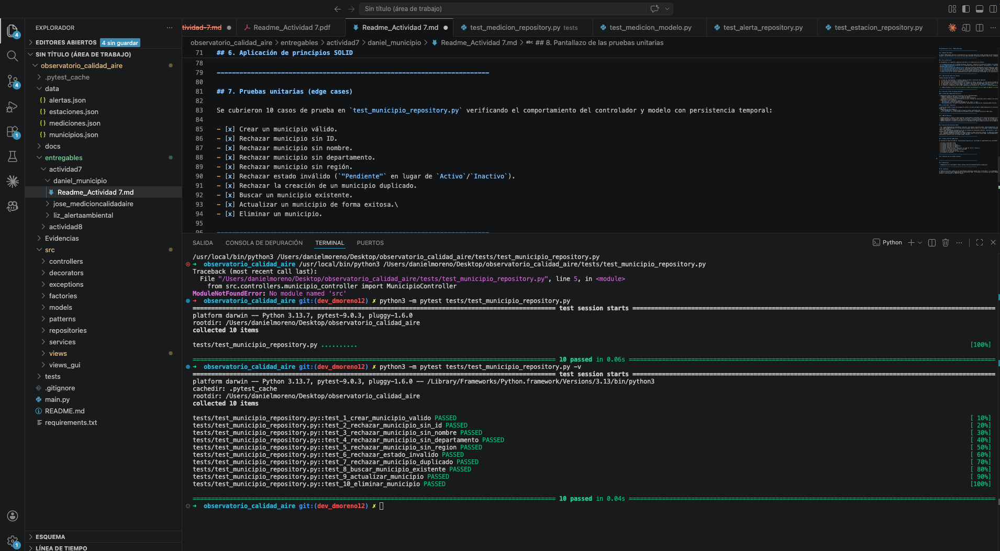

## Documentación Técnica - Módulo Municipio

------------------------------------------------------------------------

## 1. Objetivo del módulo

El módulo **Municipio** gestiona la información de los municipios dentro del sistema (entidad core del proyecto). Su objetivo es permitir operaciones CRUD (crear, consultar, actualizar y eliminar) con persistencia en un archivo de texto JSON, aplicando validaciones de negocio específicas, respetando patrones de diseño y asegurando la calidad mediante pruebas unitarias.

------------------------------------------------------------------------

## 2. Qué se desarrolló

Se implementaron los siguientes componentes basándose en la arquitectura del proyecto:

- **`src/models/municipio.py`**: Entidad de dominio `Municipio`. Contiene los atributos del objeto y las validaciones de negocio básicas (campos obligatorios y estados permitidos).
- **`src/exceptions/municipio_exceptions.py`**: Excepciones específicas del dominio (`MunicipioError`, `MunicipioNoEncontradoError`, `DatosMunicipioInvalidosError`, `ReglaNegocioMunicipioError`).
- **`src/repositories/municipio_repository.py`**: Capa de persistencia implementando el patrón Repository. Realiza el CRUD completo sobre el archivo `data/municipios.json` de manera segura.
- **`src/controllers/municipio_controller.py`**: Controlador que orquesta la lógica de negocio, validando reglas más complejas antes de interactuar con el repositorio.
- **`src/views/municipio_view.py`**: Interfaz de consola (Vista) que permite al usuario interactuar con las opciones del CRUD.
- **`tests/test_municipio_repository.py`**: Suite de 10 pruebas unitarias utilizando `pytest` para verificar los casos de éxito y *edge cases*.
- **`email_service.py`**: Servicio complementario para simular notificaciones relacionadas con las operaciones de los municipios.

------------------------------------------------------------------------

## 3. Cómo funciona dentro del proyecto

**Flujo funcional del módulo:**

1.  A través de `MunicipioView`, el usuario ingresa los datos o selecciona una operación.
2.  La vista envía la solicitud a `MunicipioController`.
3.  Para operaciones de creación/actualización, se instancia un objeto `Municipio`, el cual ejecuta su método interno `_validar()` para normalizar y verificar campos.
4.  El Controlador verifica reglas de negocio (por ejemplo, que no haya IDs duplicados o que no se elimine un municipio "Activo") y llama a `MunicipioRepository`.
5.  El Repositorio serializa el objeto usando `to_dict()` y reescribe el archivo `data/municipios.json`.
6.  Al consultar, el Repositorio lee el JSON, deserializa la información con `from_dict()` y retorna objetos de dominio.

------------------------------------------------------------------------

## 4. Definición formal de patrones aplicados

### 4.1 Patrón MVC (Model-View-Controller)

- **Definición formal:** Separa una aplicación en tres responsabilidades:
  - **Model:** Representa los datos y las reglas de negocio.
  - **View:** Presenta la información al usuario de forma interactiva.
  - **Controller:** Orquesta las solicitudes de la vista y coordina las operaciones sobre el modelo y los servicios.
- **Aplicación en este trabajo:**
  - `Municipio` actúa como nuestro **Model**.
  - `MunicipioView` es nuestra **View**, encargada de los `print` e `input`.
  - `MunicipioController` es nuestro **Controller**, manteniendo una separación de responsabilidades estricta.

### 4.2 Patrón DAO / Repository

- **Definición formal:** Objeto que encapsula el acceso a la fuente de datos y expone operaciones de lectura/escritura sin exponer los detalles de cómo o dónde se almacenan (JSON, Base de datos, etc.).
- **Aplicación en este trabajo:**
  - `MunicipioRepository` encapsula todo el acceso al archivo `municipios.json`.
  - Ni el controlador ni la vista manipulan directamente archivos ni manejan diccionarios JSON crudos.

------------------------------------------------------------------------

## 5. CRUD de Municipio

- **Create (Crear):** Inserta un nuevo municipio. Valida desde el controlador que no exista otro municipio con el mismo `id_municipio`. Si existe, lanza `ReglaNegocioMunicipioError`.
- **Read (Consultar):** Permite listar todos los municipios (`listar_municipios()`) o buscar uno en específico (`buscar_municipio()`). Lanza `MunicipioNoEncontradoError` si el ID no existe.
- **Update (Actualizar):** Reemplaza los datos de un municipio existente basándose en su ID. Si no se encuentra, lanza `MunicipioNoEncontradoError`.
- **Delete (Eliminar):** Elimina el municipio por ID. Implementa una regla de negocio estricta: **no se puede eliminar un municipio si su estado es "Activo"**.

------------------------------------------------------------------------

## 6. Aplicación de principios SOLID

- **S - Single Responsibility Principle:** `Municipio` solo valida y estructura datos; `MunicipioRepository` solo gestiona la persistencia en el archivo.
- **O - Open/Closed Principle:** El sistema permite agregar nuevos métodos en el controlador o nuevas propiedades en el modelo sin alterar el comportamiento de lectura/escritura del repositorio subyacente.
- **L - Liskov Substitution Principle:** Se creó una jerarquía de excepciones coherente (`MunicipioError` como clase base). El sistema puede capturar y manejar el tipo base sin romper el programa ante una excepción derivada específica.
- **I - Interface Segregation Principle:** Aunque en Python no usamos interfaces formales, el repositorio expone métodos CRUD precisos y pequeños (`crear`, `listar`, etc.).
- **D - Dependency Inversion Principle:** En lugar de dejar fija la ruta del archivo JSON, `MunicipioRepository` permite inyectar el `data_file` en su constructor, lo que desacopla la persistencia y permite aislar las pruebas usando `tmp_path`.

------------------------------------------------------------------------

## 7. Pruebas unitarias (edge cases)

Se cubrieron 10 casos de prueba en `test_municipio_repository.py` verificando el comportamiento del controlador y modelo con persistencia temporal:

- [x] Crear un municipio válido.
- [x] Rechazar municipio sin ID.
- [x] Rechazar municipio sin nombre.
- [x] Rechazar municipio sin departamento.
- [x] Rechazar municipio sin región.
- [x] Rechazar estado inválido (`"Pendiente"` en lugar de `Activo`/`Inactivo`).
- [x] Rechazar la creación de un municipio duplicado.
- [x] Buscar un municipio existente.
- [x] Actualizar un municipio de forma exitosa.\
- [x] Eliminar un municipio.

------------------------------------------------------------------------

## 8. Pantallazo de las pruebas unitarias

------------------------------------------------------------------------

## 9. Repositorios

- **Repositorio de la actividad:** <https://github.com/LizTuiranA/observatorio_calidad_aire>

------------------------------------------------------------------------

## 10. Conclusión

El módulo de municipios cumple con los requerimientos académicos exigidos para la Actividad 7: \* Se implementa el patrón 
**MVC** para la separación de responsabilidades. \* Se implementa el patrón de acceso a datos 
**Repository** con persistencia JSON. \* Se aplican los principios de diseño 
**SOLID**. \* Se evidencia el control de calidad mediante 
**10 pruebas unitarias** exitosas y casos borde de la lógica de negocio.
