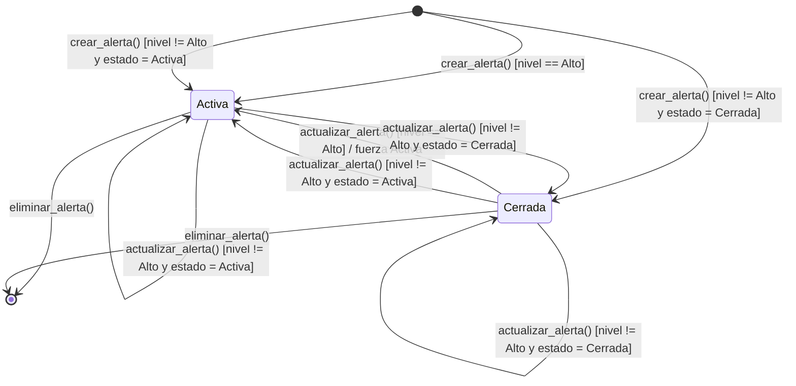
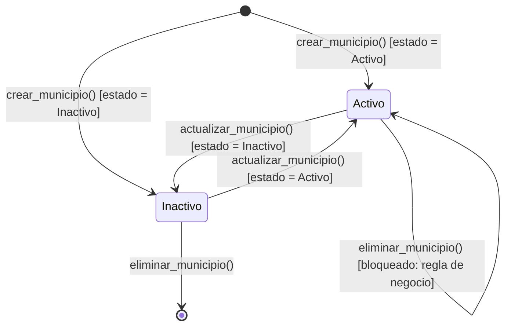
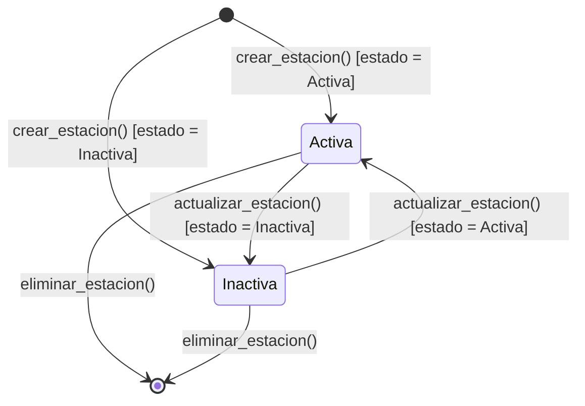

# Diagramas de estados — Observatorio de Calidad del Aire

Diagramas de state machine (UML) de las entidades que tienen un campo
`estado` y reglas de transición. 

---

## 1. AlertaAmbiental

Estados válidos: `Activa`, `Cerrada`.
Regla de negocio: si `nivel == "Alto"`, el estado se fuerza a `Activa`
(ver `src/models/alerta_ambiental.py`, método `_aplicar_regla_nivel_alto`).

**Tabla de transiciones**

| Estado origen | Evento | Guarda | Estado destino |
|---------------|--------|--------|----------------|
| (inicial) | `crear_alerta()` | `nivel == Alto` | Activa |
| (inicial) | `crear_alerta()` | `nivel != Alto` y `estado = Activa` | Activa |
| (inicial) | `crear_alerta()` | `nivel != Alto` y `estado = Cerrada` | Cerrada |
| Activa o Cerrada | `actualizar_alerta()` | `nivel == Alto` | Activa (forzada por regla de negocio) |
| Activa o Cerrada | `actualizar_alerta()` | `nivel != Alto` y `estado = Activa` | Activa |
| Activa o Cerrada | `actualizar_alerta()` | `nivel != Alto` y `estado = Cerrada` | Cerrada |
| Activa / Cerrada | `eliminar_alerta()` | — | (final) |

---

## 2. Municipio

Estados válidos: `Activo`, `Inactivo`.
Regla de negocio: no se puede eliminar un municipio en estado `Activo`
(ver `src/controllers/municipio_controller.py`, método `eliminar_municipio`).

> Nota: estando `Activo`, `eliminar_municipio()` **no** transiciona al estado
> final; lanza `ReglaNegocioMunicipioError`. Primero hay que pasarlo a
> `Inactivo`.

---

## 3. EstacionAmbiental

Estados válidos: `Activa`, `Inactiva`.

